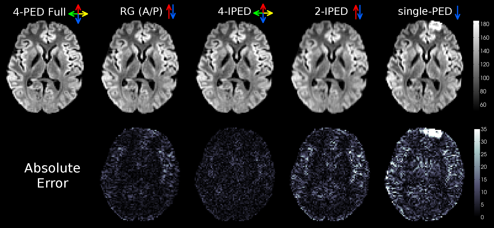
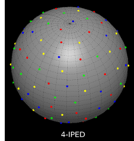

# IPED: Distortion correction using interlaced q-space sampling in diffusion MRI

This is Matlab implementation of a distortion correction method for diffusion MRI that uses interlaced phase-encoding directions (IPED) while sampling the q-space. 
The IPED technique is described in [this MRM paper](https://doi.org/10.1002/mrm.25026) and enables accurate distortion correction without increasing the overall acquisition time.

Please see [USAGE page](./USAGE.md) for details of how to use this implementation. 

Comparison of different distortion correction methods applied to in-vivo brain data:

Please cite [1] and [2] if you use this code or its derivatives in your own work.

1. C. Bhushan, A. A. Joshi, R. M. Leahy and J. P. Haldar (2014), [Improved B0-distortion correction in diffusion MRI using interlaced q-space sampling and constrained reconstruction](http://dx.doi.org/10.1002/mrm.25026). Magnetic Resonance in Medicine, 72: 1218-1232. doi: [10.1002/mrm.25026](http://dx.doi.org/10.1002/mrm.25026)

2. C. Bhushan, A. A. Joshi, R. M. Leahy and J. P. Haldar (2013), [Accelerating data acquisition for reversed-gradient distortion correction in diffusion MRI: A constrained reconstruction approach](https://archive.ismrm.org/2013/0055.html). 21st Scientific Meeting of International Society for Magnetic Resonance in Medicine (ISMRM), Salt Lake City, p. 55. [Abstract PDF](https://neuroimage.usc.edu/~chitresh/papers/ismrm_2013_EPI_distortion_correction.pdf), [ISMRM presentation video](https://cds.ismrm.org/protected/13MPresentations/0055/index.html)

Created by Chitresh Bhushan, Divya Varadarajan, Anand A. Joshi, Richard M. Leahy, and Justin P. Haldar.

## License 

Copyright (C) 2013-2023 C Bhushan, D Varadarajan, AA Joshi, RM Leahy, and JP Haldar.

IPED is licensed under either of 
 * Apache License, Version 2.0, ([LICENSE-APACHE](./LICENSE-APACHE) or http://www.apache.org/licenses/LICENSE-2.0)
 * GNU General Public License v2.0 ([LICENSE-GPL2](./LICENSE-GPL2) or https://www.gnu.org/licenses/old-licenses/gpl-2.0-standalone.html)

at your option. You can choose between one of them if you use IPED in your work.

SPDX-License-Identifier: Apache-2.0 OR GPL-2.0-only

IPED makes use of components from few external libraries, which are listed
in [NOTICE.txt](./NOTICE.txt). These components can be found in 
[3rdParty](./3rdParty) directory along with corresponding license files.

This program is free software; you can redistribute it and/or 
modify it under the terms of 
"Apache License, Version 2.0" **OR** "GNU General Public License, version 2".
This program is distributed in the hope that it will be useful,
but WITHOUT ANY WARRANTY; without even the implied warranty of
MERCHANTABILITY or FITNESS FOR A PARTICULAR PURPOSE.
Unless required by applicable law or agreed to in writing, software
distributed under the License is distributed on an "AS IS" BASIS,
WITHOUT WARRANTIES OR CONDITIONS OF ANY KIND, either express or implied.
See the Licenses linked above for more details.

In no event shall the University of Southern California, the Authors, or the 
Distributors be liable to any party for direct, indirect, special, incidental,
or consequential damages, including lost profits, arising out of the use of 
this software, its documentation, or any derivatives thereof, even if the 
authors have been advised of the possibility of such damage.

The University of Southern California, the Authors, and the Distributors 
specifically disclaim any warranties, including, but not limited to, the implied
warranties of merchantability, fitness for a particular purpose, and 
non-infringement. This software is provided on an "as is" basis, and the authors
and distributors have no obligation to provide maintenance, support, updates, 
enhancements, or modifications. This software is for research purposes only and
has not been approved for clinical use.