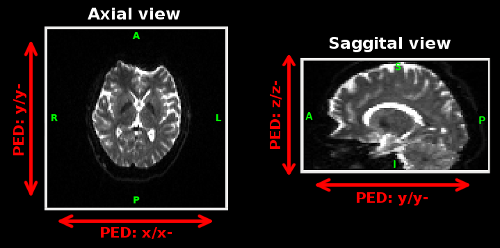

# IPED: Distortion correction using interlaced q-space sampling in diffusion MRI

This is Matlab implementation of a distortion correction method for diffusion MRI that uses interlaced phase-encoding directions (IPED) while sampling the q-space. 
The IPED technique is described in [this MRM paper](https://doi.org/10.1002/mrm.25026) and enables accurate distortion correction without increasing the overall acquisition time.

Image below shows a representative comparison of different distortion correction methods to in-vivo brain data. 

(top) The average of all distortion-corrected diffusion weighted images (DWIs) from an axial slice. (bottom) Corresponding mean absolute error of the DWI image intensities, with respect to the 4-PED Full images (used as a reference since no ground truth exists for the in-vivo data). Colored arrows indicate the PED(s) used for each method. 4-PED requires four-times the regular scan time, reversed gradient (RG) method requires twice the regular scan time, while IPED and single-PED methods require regular scan time.


Please cite [1] and [2] if you use this code or its derivatives in your own work.

1. C. Bhushan, A. A. Joshi, R. M. Leahy and J. P. Haldar (2014), [Improved B0-distortion correction in diffusion MRI using interlaced q-space sampling and constrained reconstruction](http://dx.doi.org/10.1002/mrm.25026). Magnetic Resonance in Medicine, 72: 1218-1232. doi: [10.1002/mrm.25026](http://dx.doi.org/10.1002/mrm.25026)

2. C. Bhushan, A. A. Joshi, R. M. Leahy and J. P. Haldar (2013), [Accelerating data acquisition for reversed-gradient distortion correction in diffusion MRI: A constrained reconstruction approach](https://archive.ismrm.org/2013/0055.html). 21st Scientific Meeting of International Society for Magnetic Resonance in Medicine (ISMRM), Salt Lake City, p. 55. [Abstract PDF](https://neuroimage.usc.edu/~chitresh/papers/ismrm_2013_EPI_distortion_correction.pdf), [ISMRM presentation video](https://cds.ismrm.org/protected/13MPresentations/0055/index.html)

Created by Chitresh Bhushan, Divya Varadarajan, Anand A. Joshi, Richard M. Leahy, and Justin P. Haldar.

## Usage
[IPEDcorrect.m](./IPEDcorrect.m) is the top-level Matlab function (requires Image processing toolbox). It only supports use of NIfTI-1 data format for image and plain text-files for specifying other parameters. Please also see several assumptions related to Data acquisition below. Either of following syntax is supported:
```
IPEDcorrect(IPED_config_filename, fieldmap_filename, echo_spacing, output_base)
IPEDcorrect(IPED_config_filename, fieldmap_filename, echo_spacing, output_base, opts)
```
where,

* `IPED_config_filename` is a string specifying the file-name of the IPED-config file. See below for more details about format of the IPED-config file.
* `fieldmap_filename` is a string specifying the file-name of the fieldmap saved in NIfTI-1 format. The fieldmap can acquired or estimated using any method but it must be specified in units of radians/sec. The voxel resolution of fieldmap need not match to that of the diffusion images, however for best correction it should cover the field-of-view of the diffusion scans.
* `echo_spacing` is a number specifying the echo-spacing in units of secs. Eg: For an echo spacing of 0.36ms, use 0.00036.
* `output_base` is a string specifying the file-prefix for the outputs written by IPEDcorrect. Eg: when output_base is set to sub02.IPED-corrected, the file-names of the outputs written by IPEDcorrect would be sub02.IPED-corrected.nii.gz, sub02.IPED-corrected.bvec and likewise.
* `opts` is an optional input which specifies several optional arguments, like regularization parameters, for distortion correction. See below for more details.

### IPED-config file
IPED-config file is a plain text file which describes different acquisition parameters for the diffusion data. The file follows a table-type format, which can be created and saved using a simple text editor. The IPED-config file can be saved with any extension. Each row of the file describes parameter for diffusion images corresponding to one phase-encoding direction. Number of columns in each row should be consistent and must have three, four or five columns. The first column specifies the filename of the 4D NIfTI-1 diffusion file. Second column specifies the phase encoding direction (PED). Rest of the columns specifies filenames which describe diffusion encoding parameters as shown below. In addition, any text coming after a # (hash) is ignored for rest of the line.

Four columns (with bvec, bval file):
```
4D-nifti-filename.nii.gz  PED  bvec-filename  bval-filename
```

Three columns (with bmat file):
```
4D-nifti-filename.nii.gz  PED  bmat-filename
```

Five columns (with bvec, bval and bmat file):
```
4D-nifti-filename.nii.gz  PED  bvec-filename  bval-filename bmat-filename
```

Filenames can be specified either with their full-path or without any path (for the later case, files are assumed to be in the same directory as the IPED-config file. **Relative paths are not supported** (eg: subdirectory/file.nii.gz). When the filenames/paths contain spaces then they must be enclosed in double quotes (eg: "subject23 trial2.nii.gz"). Different columns of the config file can also be delimited by comma, like that in standard csv files (in case of csv format, filenames with spaces can be directly specified and must not use double quotes).

EPI images are most distorted along the phase encoding direction (PED) and IPEDcorrect formulates the distortion correction as a 1D problem. PED can be easily be specified after visualizing the images in BrainSuite software. Valid options for PED are x, x-, y, y-, z and z-. x direction increases towards the right side of the subject, while x- increases towards the left side of the subject. Similarly, y and y- are along the anterior-posterior direction of the subject, and z and z- are along the inferior-superior direction. The figure below describes the PED directions in different views. The data shown below has PED of y-. The polarity of the PED depends on the sign convention of the fieldmap and it can be best adjusted by trying the function with different polarity.



The bvec and/or bmat files should describe diffusion encoding direction in voxel coordinate of the diffusion data (i.e. in the same frame of reference as the image matrix). Further, the order of entries of gradient direction in the specified .bvec or .bmat file must match the order of volumes in the input 4-D NIfTI data.

Following is an example of the content of an IPED-config file with four different PEDs.
```
6067JH.DWI.A.nii.gz  y- 6067JH.DWI.A.bvec  6067JH.DWI.A.bval
6067JH.DWI.P.nii.gz  y  6067JH.DWI.P.bvec  6067JH.DWI.P.bval
6067JH.DWI.L.nii.gz  x- 6067JH.DWI.L.bvec  6067JH.DWI.L.bval
6067JH.DWI.R.nii.gz  x  6067JH.DWI.R.bvec  6067JH.DWI.R.bval
```

### Optional inputs
`IPEDcorrect` can take several optional inputs to change the behavior of the different regularization terms.

* `opts.spatial_beta`: Specifies the weight for spatial regularization.
* `opts.spherical_alpha`: Specifies the weight for spherical regularization.
* `opts.shOrder`: Maximum order of the spherical-harmonic basis function used for correction. Must be even integer greater than zero.
* `opts.sph_wt`: Specifies the nature of the voxel-wise weight for spherical regularization. It can take three possible values:
  * When `opts.sph_wt` is empty string then same weight (`opts.spherical_alpha`) is used for all voxels.
  * When `opts.sph_wt` is set to 'G_mag' then the spherical weight at each voxel is scaled by magnitude of the gradient of the fieldmap at each voxel. In this case, `opts.G_mag_low` and o`pts.G_mag_high` is further used to threshold the magnitude of the gradient (in units of rad/sec/mm) as described in the paper.
  * `opts.sph_wt` can be set to name of a 3D NIfTI file, values of which is then used to scale the spherical weight at each voxel.
* `opts.estimation_mask`: Specifies the filename of a mask. When specified, this mask is used the specify the region in which the diffusion images are corrected for distortion. Usually, use of a mask has substantial impact on the runtime.
* `opts.save_SH_coeff`: Specifies how to save the estimated spherical-harmonic (SH) coefficients for diffusion weighted images. It can take three numerical values:
  * 0 : Do not save SH-coefficients.
  * 1 : Save BrainSuite style SH-coefficients (3D NIfTI volumes for each coefficient in a folder named DWI_IPED_SHcoeff.
  * 2 : Save a 4D NIfTI volume of SH-coefficients.

* `opts.isfull`: Specifies if each of the diffusion encoded image is acquired with all the PEDs. This flag only affects the format of the final output and not the estimates themselves. When set to true, each of the PEDs must have same number of diffusion encoding and same number of volumes in 4D NIfTI files.

Following Matlab structure defines the default options used in `IPEDcorrect`:
```
opts = struct(...
   'spatial_beta', 0.27, ...
   'spherical_alpha', 0.04, ...
   'shOrder', 8, ...
   'sph_wt', 'G_mag', ...
   'G_mag_low', 1*2*pi, ...
   'G_mag_high', 9*2*pi, ...
   'estimation_mask', '', ...
   'isfull', false, ...
   'save_SH_coeff', 1 ...
   );
```

## Data acquisition


This implementation makes several assumptions about the data acquisition, data format and sampling pattern in the q-space. All of the following must be satisfied for accurate correction:

* The diffusion data should be scanned with single-shot Echo Planar Imaging (EPI) sequence.
* The EPI planes for data acquired with different phase encoding directions (PED) must coincide. This also implies that ignoring the polarity of PEDs there could be maximum of two PEDs, one along each dimension of 2D EPI plane (without ignoring the polarity of PEDs there could be maximum of four PEDs).
* Atleast two different PEDs must be used to sample the q-space.
* All the diffusion weighted images must be acquired with a single b-value i.e. assumes single-shell acquisition (multi-shell acquisition can also be used - by correcting diffusion data for each shell separately).
* Atleast one diffusion image must be acquired with (almost) no diffusion weighting (b-value of zero) for each unique PED.
* The inhomogeneity in main magnetic field (B0) should be same across all diffusion weighted images i.e. all the diffusion images must be acquired with same shim settings.
* The field of view, voxel resolution, image matrix size, number of slices and slice thickness should be consistent across all diffusion weighted images.
* All the input diffusion data should be the reconstructed magnitude diffusion weighted images. Complex k-space data (raw-data) or real-valued data is not supported in this implementation.

Further, take note about following to enable accurate distortion correction with IPED method with this implementation:

* It is recommended to use more than 20 unique diffusion encoding directions. Larger number of diffusion encoding direction would enable better correction.
* The diffusion encoding directions should be evenly distributed on the sphere (or one hemisphere). The sampling directions are plotted for easy visualization in this implementation.
* The diffusion encoding directions for each PEDs should be evenly interlaced i.e. encoding directions should be evenly distributed for each unique PED as well as for union of all PEDs.
* In case of multi-shell acquisition, the above recommendation applies to each shell.
* For data acquired using parallel imaging technique, the input echo spacing should be set to the effective echo spacing. Eg. if a 2X acceleration was achieved with parallel imaging then the effective echo spacing should be half of the echo spacing used in the sequence.

This implementation also works with reversed-gradient ([Chang and Fitzpatrick, 1992](http://dx.doi.org/10.1109/42.158935)) and its generalized acquisition schemes without any modification. Also see optional inputs for more options about generalized reversed-gradient schemes.

## License 

IPED is licensed under either of 
 * Apache License, Version 2.0, ([LICENSE-APACHE](./LICENSE-APACHE) or http://www.apache.org/licenses/LICENSE-2.0)
 * GNU General Public License v2.0 ([LICENSE-GPL2](./LICENSE-GPL2) or https://www.gnu.org/licenses/old-licenses/gpl-2.0-standalone.html)

at your option. You can choose between one of them if you use IPED in your work.

IPED makes use of components from few external libraries, which are listed in [NOTICE.txt](./NOTICE.txt). These components can be found in [3rdParty](./3rdParty) directory along with their license files.

SPDX-License-Identifier: Apache-2.0 OR GPL-2.0-only

In no event shall the University of Southern California, the Authors, or the Distributors be liable to any party for direct, indirect, special, incidental, or consequential damages, including lost profits, arising out of the use of this software, its documentation, or any derivatives thereof, even if the authors have been advised of the possibility of such damage. 

The University of Southern California, the Authors, and the Distributors specifically disclaim any warranties, including, but not limited to, the implied warranties of merchantability, fitness for a particular purpose, and non-infringement. This software is provided on an "as is" basis, and the authors and distributors have no obligation to provide maintenance, support, updates, enhancements, or modifications. This software is for research purposes only and has not been approved for clinical use.

